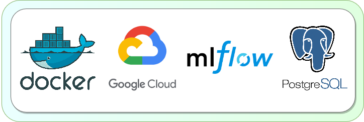

<!-- Improved compatibility of back to top link: See: https://github.com/othneildrew/Best-README-Template/pull/73 -->
<a name="readme-top"></a>

<!-- PROJECT LOGO -->
<br />
<div align="center">
  <a>
    
  </a>

<h2 align="center">The Ultra-Practical Guide to Setting Up MLflow, Postgres, and pgAdmin with Docker on GCP</h2>

  <p align="center">
    Automate deployment of MLFlow on GCP

</div>


<!-- TABLE OF CONTENTS -->
<details open>
  <summary>Table of Contents</summary>
  <ol>
    <li>
      <a href="#about-the-project">About The Project</a>
    </li>
    <li>
      <a href="#getting-started">Getting Started</a>
      <ul>
        <li><a href="#prerequisites">Prerequisites</a></li>
        <li><a href="#installation">Installation (Locally)</a></li>
        <li><a href="#installation">Installation (GCP)</a></li>
      </ul>
    </li>
    <li><a href="#usage">Usage</a></li>
    <li><a href="#files">Files</a></li>
    <li><a href="#contributing">Contributing</a></li>
    <li><a href="#license">License</a></li>
  </ol>
</details>


<!-- ABOUT THE PROJECT -->
## About The Project

This project automates the deployment of MLflow, Postgres, and pgAdmin services using Docker Compose on Google Cloud 
Platform (GCP). It's designed for machine learning practitioners and data scientists who need a robust ML experiment 
tracking and database management setup in the cloud.

<p>It uses Docker Compose to create a cohesive environment linking MLflow for experiment tracking, Postgres as a database 
backend, and pgAdmin for database management.</p>

<p align="right">(<a href="#readme-top">back to top</a>)</p>


<!-- GETTING STARTED -->
## Getting Started


### Prerequisites

You will need the following:
* [A GCP account](https://www.geeksforgeeks.org/how-to-create-a-free-tier-account-on-gcp/)
  * [Enable the necessary APIs](https://cloud.google.com/endpoints/docs/openapi/enable-api) - Cloud Storage, Compute 
  Engine etc
* [Docker and Docker Compose](https://docs.docker.com/engine/install/)
* [A service account with keys](https://cloud.google.com/iam/docs/keys-create-delete)
* [gcloud CLI](https://cloud.google.com/sdk/docs/install)
* Some Docker and GCP know-how


### Installation (Locally)
1. Clone this repo `git clone https://github.com/cormac-rynne/mlflow-gcp`
2. Create 2 copies of `.env.sample` in the root directory
   * One as `.env` (this will be for local) 
   * One as `.env.prod` (this will be for GCP)
3. Fill in the variables
   * The same for both, except `GOOGLE_CREDENTIALS` in `.env.prod` must be
   `GOOGLE_CREDENTIALS_PATH=/gcp_credentials.json`
   * `EMAIL_PASSWORD_STORAGE` is your email with `.` and `@` substituted 
   with `_`
4. Make a copy of `servers.json.sample` and call it `servers.json`
   * Make sure the `Username` matches the `.env` file usernames, and the email
   in the passfile string is the same as `EMAIL_PASSWORD_STORAGE`
5. Open Bash, run docker
   ```sh
   docker compose up -d
   ```
6. Open the webpages
   * http://localhost:8000 (MLFlow)
   * http://localhost:5000 (pgAdmin)


### Installation (GCP)
You can run `./scripts/buildall.sh`, or if you want to do it step by step, you use:
1. Run `./scripts/create.sh` script to create the VM and install Docker
2. Run `./scripts/firewall.sh` script to create a firewall, tag it to the VM, and 
whitelist your own IP address
3. Run `./scripts/transfer.sh` script to move the credentials, .env, servers.json and docker-compose file to the VM.
4. Run `./scripts/up.sh` script to run `docker compose up -d` in the VM.
   * You should see the following: 
```sh
The external IP address of the VM is: w.x.y.z
MLFlow: http://w.x.y.z:8000
PgAdmin: http://w.x.y.z:5000
```

To delete everything, just use `./scripts/deleteall.sh`, but this will also delete your
VM instance that holds all the experimentation data in the postgres database.


<!-- USAGE EXAMPLES -->
## Usage
<h3> Shutting down </h3>

To shut down everything, run `./scripts/stop.sh`

Or you can [do it through the UI](https://cloud.google.com/compute/docs/instances/stop-start-instance#:~:text=To%20stop%20a%20VM%2C%20use,or%20the%20Compute%20Engine%20API.&text=In%20the%20Google%20Cloud%20console%2C%20go%20to%20the%20VM%20instances%20page.&text=Select%20one%20or%20more%20VMs,Click%20Stop.)

<h3> Starting up again </h3>

To start up everything again, run `./scripts/start.sh`

<p align="right">(<a href="#readme-top">back to top</a>)</p>

## Files
<h3>Root (./)</h3>
1. docker-compose.yaml: Orchestrates the deployment of MLflow, Postgres, and pgAdmin services using Docker.

2. .env.sample: Template for environment variables required for configuring the Docker services.

3. servers.json.sample: Sample configuration file for setting up the pgAdmin server to connect to Postgres by default.

<h3>Scripts (./scripts/)</h3>

4. config.sh: Script to set environment variables and configurations for the VM and other project files in GCP.

5. create.sh: Automates the creation of a GCP VM instance and the installation of Docker.

6. firewall.sh: Sets up firewall rules in GCP for secure access to the services.

7. transfer.sh: Handles the transfer of Docker Compose, environment, and configuration files to the GCP VM.

8. up.sh: Executes Docker Compose on the VM to start the services.

9. start.sh: Checks the VM status, starts it if necessary, and runs the up.sh script to launch the services.

10. stop.sh: Gracefully shuts down the GCP VM, stopping all services.


<!-- CONTRIBUTING -->
## Contributing

Contributions are what make the open source community such an amazing place to learn, inspire, and create. 
Any contributions you make are **greatly appreciated**.

If you have a suggestion that would make this better, please fork the repo and create a pull request. You can 
also simply open an issue with the tag "enhancement".

Don't forget to give the project a star! Thanks again!

1. Fork the Project
2. Create your Feature Branch (`git checkout -b feature/AmazingFeature`)
3. Commit your Changes (`git commit -m 'Add some AmazingFeature'`)
4. Push to the Branch (`git push origin feature/AmazingFeature`)
5. Open a Pull Request

<p align="right">(<a href="#readme-top">back to top</a>)</p>


<!-- LICENSE -->
## License

Distributed under the MIT License. See `LICENSE.txt` for more information.

<p align="right">(<a href="#readme-top">back to top</a>)</p>
